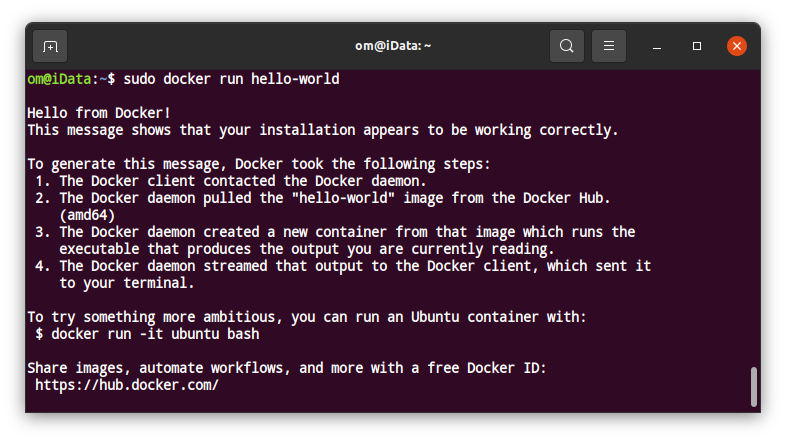

# Penjelasan Docker


Docker adalah *tools open source* yang dirancang untuk memudahkan pembuatan, penerapan, dan menjalankan aplikasi dengan menggunakan kontainer.

Kontainer memungkinkan *developer* untuk mengemas aplikasi dengan semua bagian yang dibutuhkannya, seperti *libraries* dan dependensi lainnya, dan menerapkannya sebagai satu paket.[[1]](#1)

# Cara Kerja Docker
[[2]](#2)

# Install Docker
## Install Docker di Linux

Install menggunakan repository[[3]](#3)

1. Update repository dan install beberapa packages

```
sudo apt-get update

sudo apt-get install \
    apt-transport-https \
    ca-certificates \
    curl \
    gnupg-agent \
    software-properties-common
```


2. Tambahkan Docker’s official GPG key ke repository

```
curl -fsSL https://download.docker.com/linux/ubuntu/gpg | sudo apt-key add -

sudo apt-key fingerprint 0EBFCD88

sudo add-apt-repository \
   "deb [arch=amd64] https://download.docker.com/linux/ubuntu \
   $(lsb_release -cs) \
   stable"

```


3. Install docker-engine

```
sudo apt-get update

sudo apt-get install docker-ce docker-ce-cli containerd.io
```


4. Install docker-compose [[4]](#4)

```
sudo curl -L "https://github.com/docker/compose/releases/download/1.27.4/docker-compose-$(uname -s)-$(uname -m)" -o /usr/local/bin/docker-compose

sudo chmod +x /usr/local/bin/docker-compose
```


5. Tes docker `hello-world`

```
sudo docker run hello-world
```



# Referensi
<a id="1">[1]</a> 
https://opensource.com/resources/what-docker

<a id="2">[2]</a> 
https://docs.docker.com/get-started/overview/#docker-architecture

<a id="3">[3]</a> 
https://docs.docker.com/engine/install/ubuntu/

<a id="4">[4]</a>
https://forum.getodk.org/t/setting-up-odk-central-on-an-ubuntu-18-04-server/30241/10