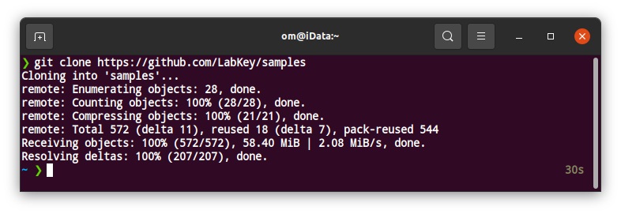
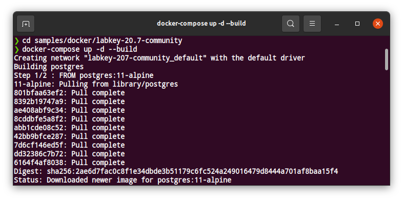
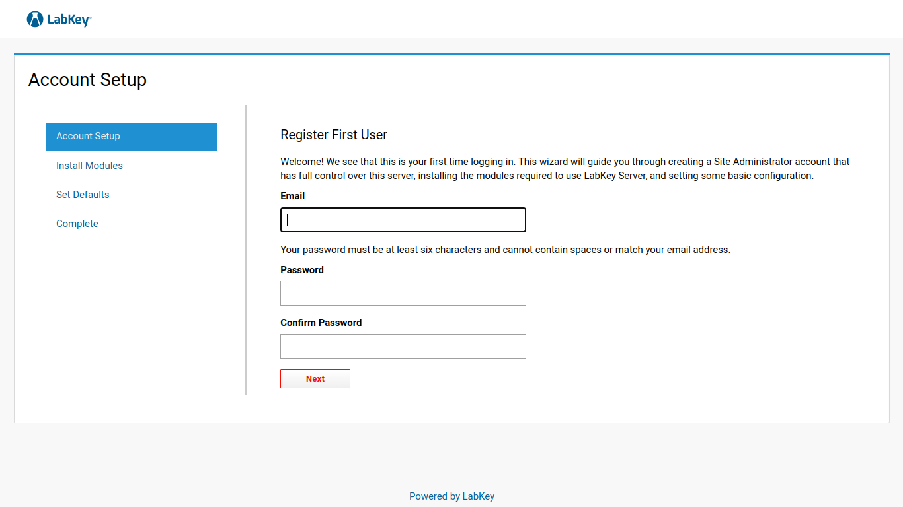

# Penjelasan Labkey

LabKey merupakan penyedia perangkat lunak dan layanan profesional yang terspesialisasi dalam membantu organisasi mengatasi manajemen data, kolaborasi, dan alur kerja dalam lingkungan penelitian ilmiah [[1]](#1).

[LabKey Server](https://www.labkey.com/products-services/labkey-server/) merupakan *open-source platform* yang dirancang untuk mengintegrasikan, menganalisis, dan berbagi data biomedis yang kompleks [[2]](#2).


# Install Labkey Server
## Install Labkey Server di Local Linux [[3]](#3)

Menggunakan LabKey Server Community edition versi 20.7.

Ini hanya digunakan untuk testing.

1. Download repository dari github

```
git clone https://github.com/LabKey/samples
```



2. Masuk ke folder samples/docker/labkey-20.7-community

```
cd samples/docker/labkey-20.7-community
```

3. Build software dengan docker

```
docker-compose up -d --build
```



4. Buka Labkey di link http://localhost:8080/labkey dan buat akun



5. Untuk stop LabKey service

```
docker-compose down
```


# Referensi
<a id="1">[1]</a> 
https://www.labkey.com/about/

<a id="2">[2]</a> 
https://www.labkey.com/products-services/labkey-server/

<a id="3">[3]</a>
https://github.com/LabKey/samples/tree/master/docker/labkey-20.7-community