# Penjelasan OpenDataKit (ODK)

[OpenDataKit](https://getodk.org/) (ODK) merupakan *open-source software* dan gratis yang membantu untuk mengumpulkan data dengan cepat, akurat, offline, dan dalam skala besar [[1]](#1).

[ODK Central](https://docs.getodk.org/central-intro/) adalah *data clearinghouse* berbasis cloud yang menggantikan software [ODK Aggregate](https://docs.getodk.org/aggregate-intro/). ODK Central mengelola akun pengguna dan izin, menyimpan definisi formulir, dan memungkinkan user pengumpulan data seperti ODK Collect.

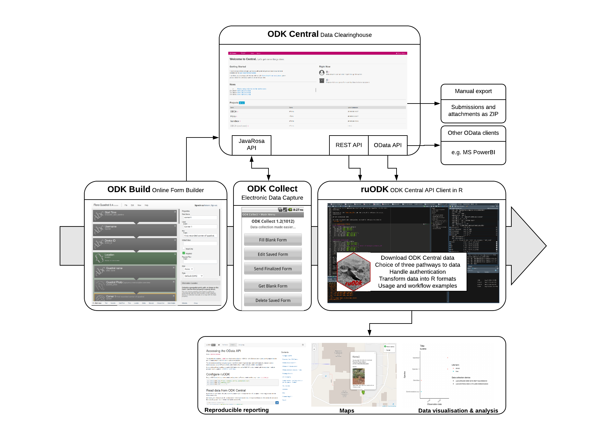

# Install ODK Central
## Install ODK Central di Local Linux [[2]](#2)

1. Download repository / software dari github

```
git clone https://github.com/getodk/central
```

Masuk ke folder odk central

```
cd central
```

Download komponen / submodul software

```
git submodule update -i
```

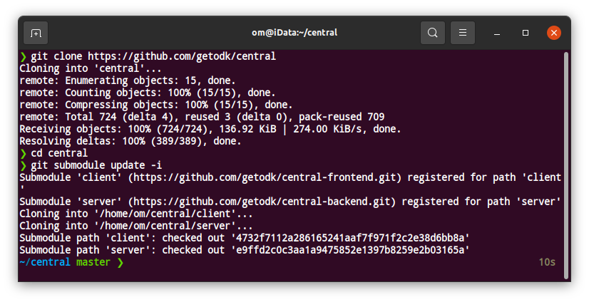

2. Edit setting / environment docker untuk ODK Central

```
nano .env
```

Ubah settingan menjadi seperti di bawah ini
```
SSL_TYPE=selfsign
DOMAIN=localhost
SYSADMIN_EMAIL=okkymabrur@gmail.com
```

*SYSADMIN_EMAIL diisi email admin

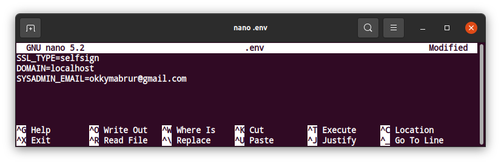


3. Menggabungkan semuanya dengan docker

```
docker-compose build
```
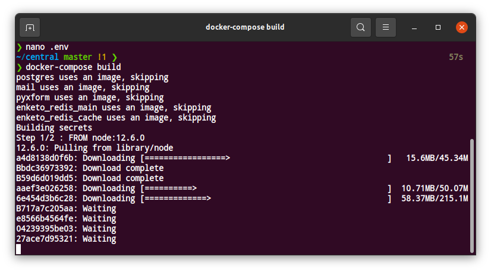

Tunggu sampai semua terunduh dan terinstall

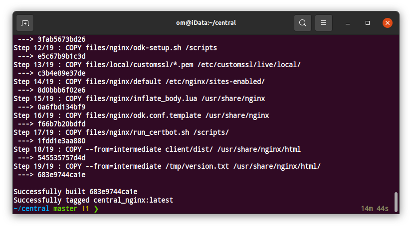

Ketika semua sudah terinstall maka akan muncul teks **Successfully built**. Kemudian lakukan `docker compose`  tunggu prosesnya sampai selesai.

```
docker-compose up --no-start
```

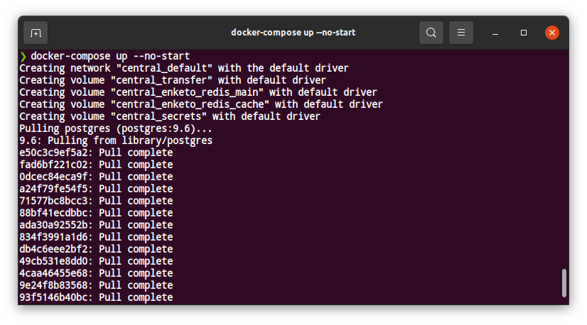
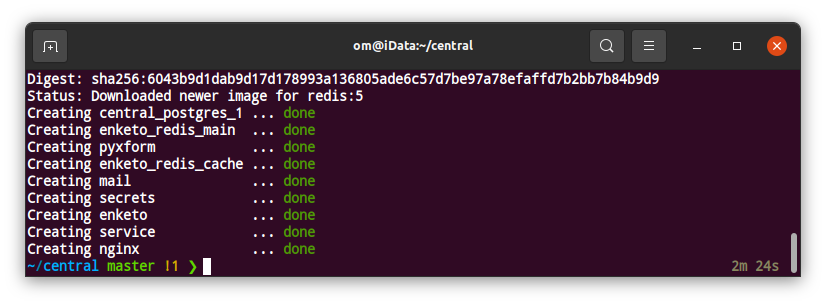

Anda akan melihat terminal seperti gambar di atas jika `docker compose` telah selesai


4. Start ODK Central

```
docker-compose up -d
```

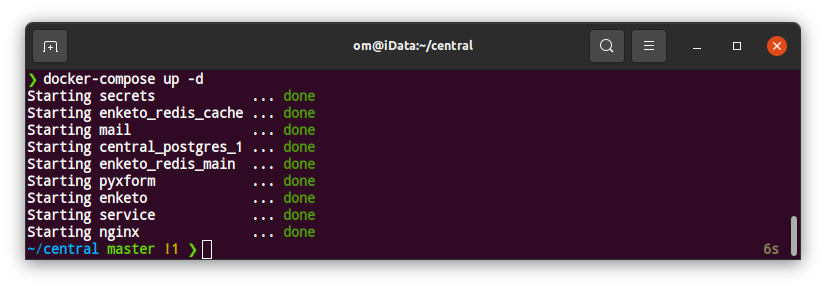


5. Setting Akun Administrator

```
docker-compose exec service odk-cmd --email YOUREMAIL@ADDRESSHERE.com user-create

docker-compose exec service odk-cmd --email YOUREMAIL@ADDRESSHERE.com user-promote

```

Misalkan

```
docker-compose exec service odk-cmd --email okkymabrur@gmail.com user-create

docker-compose exec service odk-cmd --email okkymabrur@gmail.com user-promote

```

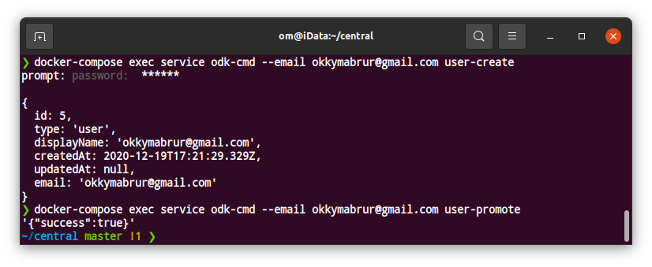


6. Masuk ke ODK Central

Masuk ke https://localhost/

Jika muncul warning / peringatan, abaikan dan lanjutkan.

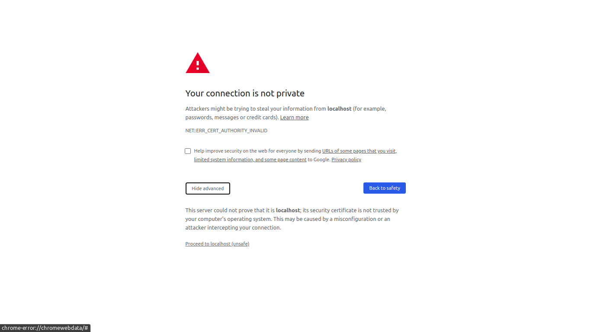

Masukkan akun dan password

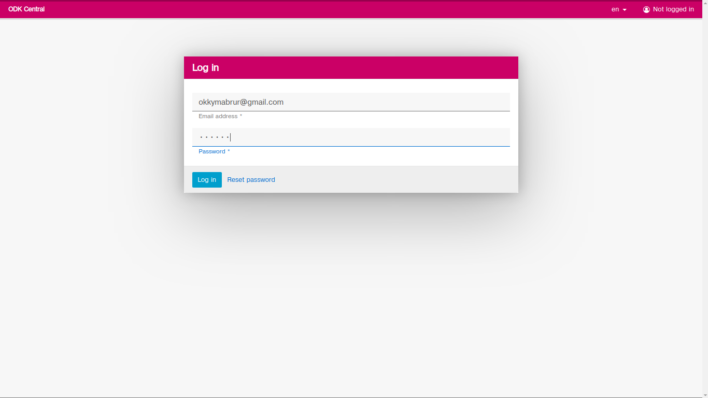

ODK berhasil terinstall

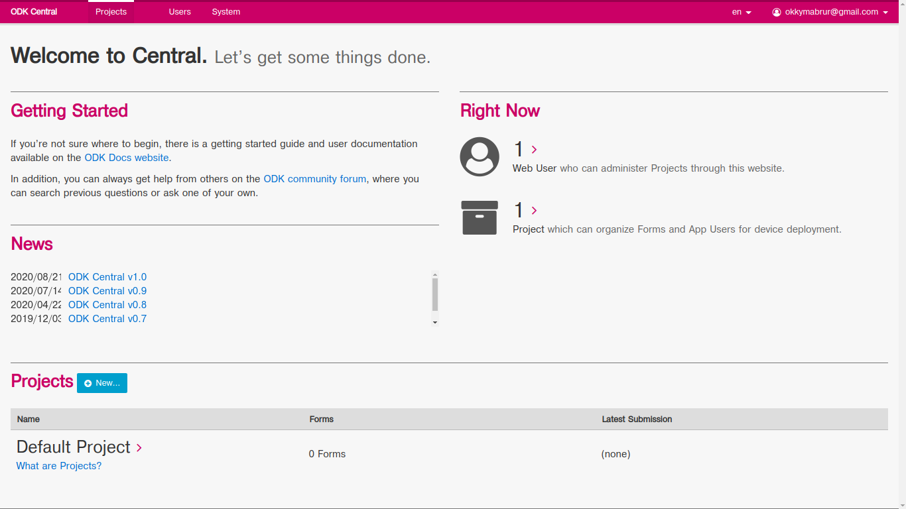


# Referensi
<a id="1">[1]</a> 
https://docs.ropensci.org/ruODK/

<a id="2">[2]</a> 
https://docs.getodk.org/central-install-digital-ocean/