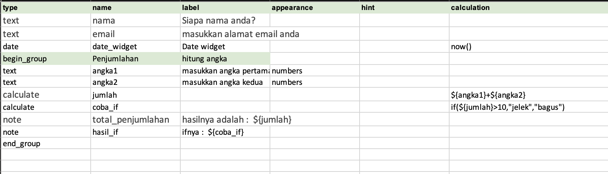
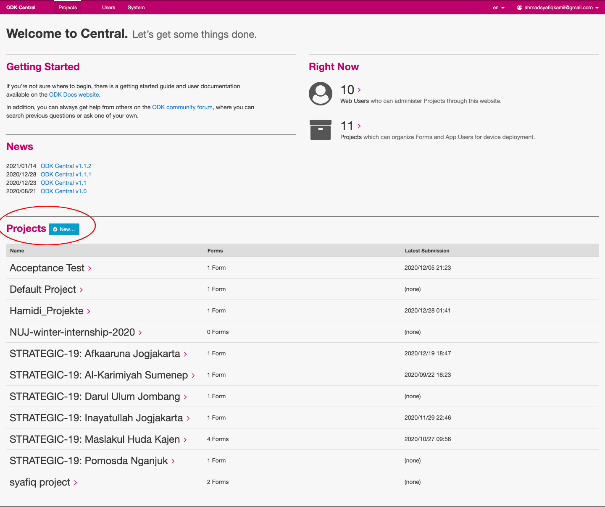
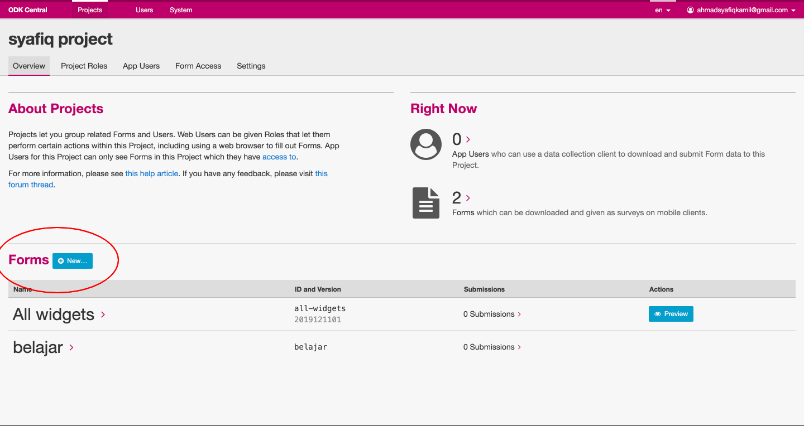
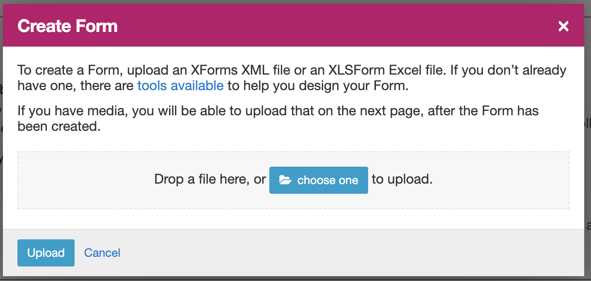
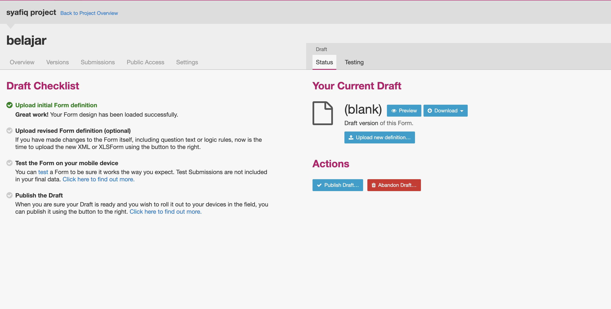
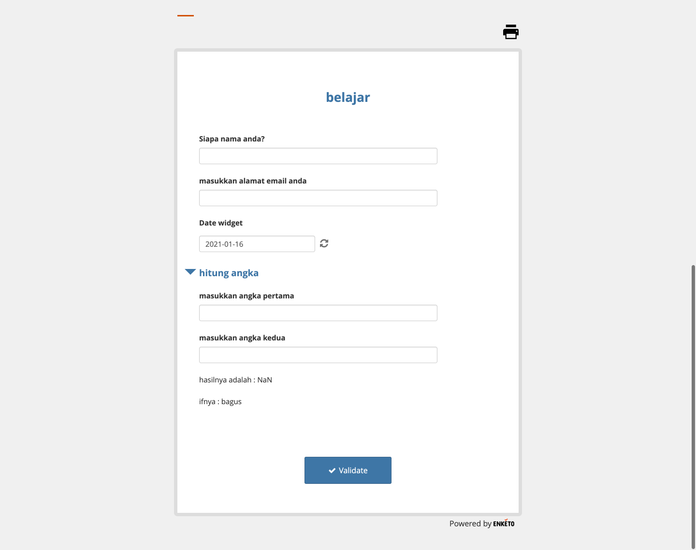

# XLSForm

XLSForm adalah standar formulir yang dibuat untuk membantu menyederhanakan penulisan formulir di Excel. XLSForms mudah digunakan, tetapi memungkinkan pembuatan formulir yang kompleks. Formulir yang dirancang dengan Excel bisa diubah menjadi XForms yang bisa digunakan oleh ODK.

# [Jenis Pertanyaan](https://docs.getodk.org/form-question-types/)

ODK Collect mendukung formulir dengan berbagai jenis pertanyaan. Fungsionalitas dan gaya tampilan yang tepat dari setiap pertanyaan ditentukan dalam definisi XLSForm Anda menggunakan kolom tipe dan tampilan.

* [Text widgets](https://docs.getodk.org/form-question-types/#text-widgets)
* [Number widgets](https://docs.getodk.org/form-question-types/#number-widgets)
* [Date and time widgets](https://docs.getodk.org/form-question-types/#date-and-time-widgets)
* [Select widgets](https://docs.getodk.org/form-question-types/#select-widgets)
* [Rank widget](https://docs.getodk.org/form-question-types/#rank-widget)
* [Location widgets](https://docs.getodk.org/form-question-types/#location-widgets)
* [Image widgets](https://docs.getodk.org/form-question-types/#image-widgets)
* [Audio widget](https://docs.getodk.org/form-question-types/#audio-widget)
* [Video widgets](https://docs.getodk.org/form-question-types/#video-widgets)
* [File upload widget](https://docs.getodk.org/form-question-types/#file-upload-widget)
* [Barcode widget](https://docs.getodk.org/form-question-types/#barcode-widget)
* [Range widgets](https://docs.getodk.org/form-question-types/#range-widgets)
* [Note widget](https://docs.getodk.org/form-question-types/#note-widget)
* [URL widget](https://docs.getodk.org/form-question-types/#url-widget)
* [Printer widget](https://docs.getodk.org/form-question-types/#printer-widget)
* [Trigger/acknowledge widget](https://docs.getodk.org/form-question-types/#trigger-acknowledge-widget)
* [Signature widget](https://docs.getodk.org/form-question-types/#signature-widget)
* [Hidden questions](https://docs.getodk.org/form-question-types/#hidden-questions)
* [Grouping multiple widgets on the same screen](https://docs.getodk.org/form-question-types/#grouping-multiple-widgets-on-the-same-screen)
* [Grid of selects on the same screen](https://docs.getodk.org/form-question-types/#grid-of-selects-on-the-same-screen)

# [Form Logic](https://docs.getodk.org/form-logic/)

ODK Collect mendukung berbagai perilaku bentuk dinamis. Dokumen ini membahas cara menentukan perilaku ini dalam definisi XLSForm Anda.

# [Form Styling](https://docs.getodk.org/form-styling/)

Pertanyaan dapat mencakup Media seperti gambar, suara atau video. Selain itu, label, petunjuk, dan pilihan dalam XLSForm semuanya dapat diberi gaya menggunakan Penurunan harga, font dan warna, dan Emoji.

# [Form Language](https://docs.getodk.org/form-language/)

ODK Collect dan XLSForm mendukung formulir multi-bahasa.

Untuk menambahkan bahasa tambahan ke XLSForm Anda, tambahkan kolom konten yang dihadapi pengguna dengan kolom khusus bahasa.

# [Form Operators and Function](https://docs.getodk.org/form-operators-functions/)

 Ekspresi dalam penghitungan, batasan, dan relevansi dapat berisi operator dan fungsi.

# membuat form sederhana

buat form sesuai dengan gambar

setelah selesai membuat form, upload di odk. sebelum upload kita buat terlebih dahulu projectnya

akan muncul halaman project, setelah itu tekan tombol new dekat tulisan form

akan muncul modal untuk upload form

setelah itu akan diarahkan ke halaman form, jika ingin melihat hasilnya, tekan tombol preview

hasil form sederhana yang telah kita buat

# Referensi
<a id="1">[1]</a> https://docs.getodk.org/xlsform/

<a id="2">[2]</a> https://xlsform.org/
